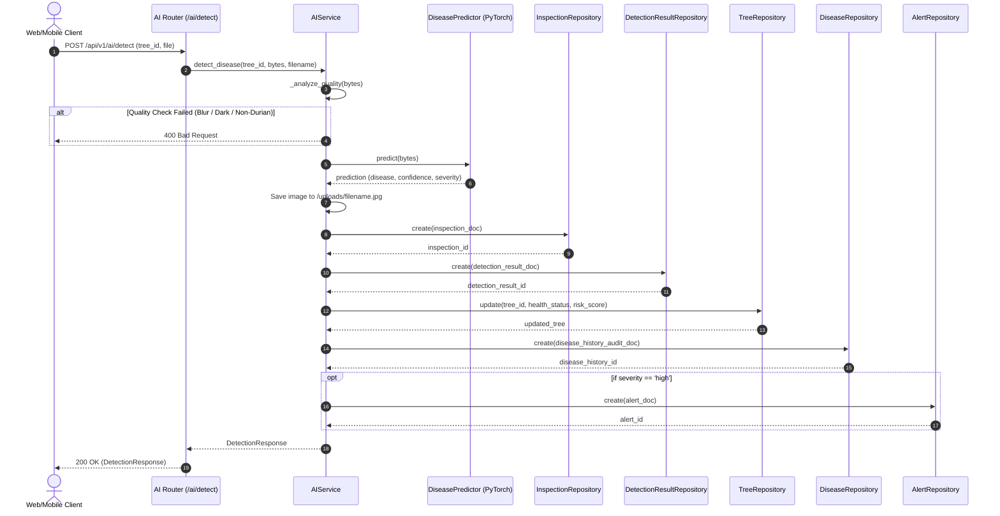
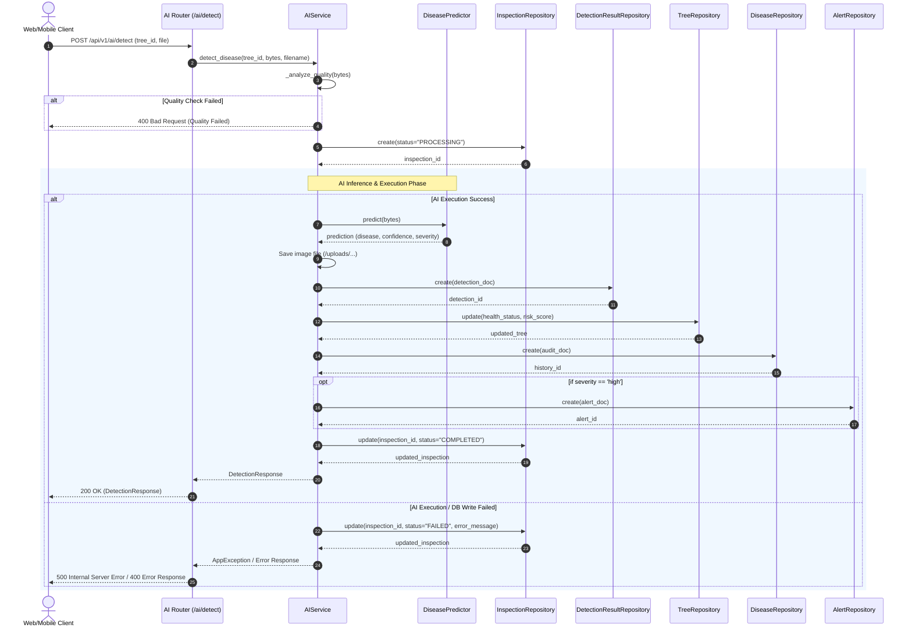

# Project Information

- **Project:** Durian Guardian AI (DGA)
- **Release:** 2.0
- **Step:** STEP 1 — AI WORKFLOW DECISION
- **Agent:** Antigravity IDE
- **Mode:** STRICT ARCHITECTURE DECISION (READ ONLY)
- **Date:** 2026-08-02

---

# Current Architecture

Dựa trên kết quả từ `AI_MERGE_AUDIT.md`:
- API `POST /api/v1/ai/detect` chạy kiểm tra chất lượng ảnh (Quality Check) $\rightarrow$ Inference qua PyTorch EfficientNet-B0 $\rightarrow$ Lưu tệp ảnh vào `/uploads/` $\rightarrow$ Ghi dữ liệu duy nhất vào collection **`disease_history`**.
- Dashboard đọc dữ liệu từ: **`trees`** (KPI & Heatmap), **`inspections`** (Recent Activity), **`alerts`** (Báo động).
- **Khoảng trống:** Chẩn đoán AI hiện chưa đồng bộ sang `inspections`, `detection_results`, `trees` và `alerts`, khiến Dashboard không cập nhật kết quả AI tự động.

---

# Final Workflow Decision

DGA chính thức chốt **DUY NHẤT** 1 Workflow AI đồng bộ toàn diện cho Release 2.0:

1. **Inspection được tạo ở đâu?**
   - **SAU AI INFERENCE** (Sau khi kiểm tra chất lượng ảnh và chạy mô hình AI thành công).
   - **Lý do:** Đảm bảo không sinh ra các bản ghi rác/mồ côi trong DB nếu ảnh tải lên bị mờ, quá tối hoặc không phải lá sầu riêng.

2. **Detection Result được tạo ở đâu?**
   - Được tạo ngay sau bước tạo Inspection, lưu chi tiết kết quả chẩn đoán AI (tên bệnh, độ tin cậy `confidence`, mức độ `severity`, đường dẫn ảnh `/uploads/`) vào collection `detection_results`.

3. **Tree Update được cập nhật ở bước nào?**
   - Được cập nhật ngay sau khi ghi `detection_results`.
   - **Các trường cập nhật trong document `trees`:**
     - `health_status`: Tên bệnh tiếng Việt (hoặc `"Khỏe mạnh"`).
     - `risk_score`: Điểm rủi ro tính theo severity (`none` = 10, `low` = 40, `medium` = 70, `high` = 90).
     - `updated_at`: Thời gian hiện tại.

4. **Disease History:**
   - Định danh chính thức: **Audit Log** (Bản ghi nhật ký lịch sử không thay đổi - Immutable Log - để truy xuất và xem lại tiến trình chẩn đoán theo thời gian).

5. **Alert:**
   - **Sinh khi nào:** Tự động tạo bản ghi trong collection `alerts` khi `severity == "high"` (ví dụ: Phytophthora, thối quả, cháy thân, sẹo thân nghiêm trọng).

6. **Dashboard Architecture:**
   - Giữ nguyên kiến trúc Dashboard hiện tại, tiếp tục đọc từ 3 collection cốt lõi:
     - **`trees`**: Render KPI Cards & Heatmap Grid.
     - **`inspections`**: Render Recent Activity list.
     - **`alerts`**: Render Priority Alerts & Panel Đánh Giá Vườn.

---

# Repository Flow

Thứ tự gọi Repository chính thức khi API `POST /api/v1/ai/detect` thực thi:

```text
1. TreeRepository.get(tree_id)
   └─ Kiểm tra cây tồn tại & lấy thông tin vị trí

2. InspectionRepository.create(...)
   └─ Tạo lượt kiểm tra mới trong collection 'inspections'

3. DetectionResultRepository.create(...)
   └─ Lưu chi tiết kết quả AI vào collection 'detection_results'

4. TreeRepository.update(tree_id, ...)
   └─ Cập nhật 'health_status', 'risk_score', 'updated_at' trong collection 'trees'

5. DiseaseRepository.create(...)
   └─ Ghi bản ghi Audit Log vào collection 'disease_history'

6. AlertRepository.create(...)  [ĐIỀU KIỆN: severity == 'high']
   └─ Tự động tạo cảnh báo nguy cơ cao trong collection 'alerts'
```

---

# Collection Flow

```text
Upload Image Bytes
       │
       ▼
Quality Check (OpenCV) ──[Fail]──► Throw 400 Bad Request
       │ (Pass)
       ▼
AI Inference (EfficientNet-B0)
       │
       ▼
Save Uploaded File (/uploads/...)
       │
       ├──► 1. Insert 'inspections'
       ├──► 2. Insert 'detection_results'
       ├──► 3. Update 'trees' (health_status & risk_score)
       ├──► 4. Insert 'disease_history' (Audit Log)
       └──► 5. Insert 'alerts' (nếu severity == 'high')
       │
       ▼
Dashboard UI Auto-Refreshes Realtime Data
```

---

# Transaction Boundary

- **Chiến lược:** In-Memory Validation & Compensating Rollback Action.
- **Phạm vi:**
  - Bước Quality Check & AI Inference chạy thuần túy trên RAM. Nếu thất bại ở bước này, **0% dữ liệu bị ghi vào DB**.
  - Nếu xảy ra lỗi bất ngờ ở giữa các bước ghi DB (bước 2-6), hệ thống catch exception, thực hiện xóa bù các bản ghi vừa tạo (Compensating Delete for `inspection_id` và `detection_result_id`) và ném ngoại lệ `HTTP 500` để đảm bảo tính toàn vẹn dữ liệu.

---

# Sequence Diagram



---

# Files Modified

**NONE**

---

# Final Decision

**APPROVED FOR IMPLEMENTATION**

---

# Architecture Decision Update

> [!IMPORTANT]
> **Cập nhật Kiến trúc từ Technical Lead (Release 2.0 - STEP 1.1)**

### 1. Inspection Lifecycle

Quy trình quản lý vòng đời lượt kiểm tra (`Inspection`) chính thức chuyển sang mô hình **Status Lifecycle** (`PROCESSING` $\rightarrow$ `COMPLETED` / `FAILED`):

```text
Quality Check (PASS)
       │
       ▼
InspectionRepository.create(status="PROCESSING")
       │
       ▼
AI Inference (EfficientNet-B0)
       │
       ▼
Save Upload File (/uploads/...)
       │
       ▼
DetectionResultRepository.create()
       │
       ▼
TreeRepository.update(health_status, risk_score)
       │
       ▼
DiseaseHistoryRepository.create()  (Audit Log)
       │
       ▼
[Nếu severity == "high"] ──► AlertRepository.create()
       │
       ▼
InspectionRepository.update(status="COMPLETED")
```

### 2. Xử lý khi AI Thất bại (Failure Handling)

Nếu xảy ra lỗi ở bất kỳ bước nào trong quá trình AI Inference hoặc ghi cơ sở dữ liệu:
- **KHÔNG xóa Inspection.**
- **KHÔNG sử dụng Compensating Delete.**
- **KHÔNG Rollback Document.**
- Bản ghi `Inspection` sẽ được cập nhật sang trạng thái thất bại: `status = "FAILED"`, `error_message = "<nội dung lỗi>"`, `updated_at` nhằm bảo lưu toàn bộ nhật ký lịch sử thao tác kiểm tra của người dùng.

### 3. Transaction Policy

- Loại bỏ hoàn toàn cơ chế Compensating Delete.
- Áp dụng triệt để **Inspection Status Lifecycle**:
  - `PROCESSING`: Khi vừa vượt qua Quality Check và bắt đầu chẩn đoán.
  - `COMPLETED`: Khi toàn bộ quy trình AI, lưu kết quả, cập nhật cây và tạo cảnh báo thành công.
  - `FAILED`: Khi có ngoại lệ hoặc lỗi phát sinh trong quá trình chẩn đoán/lưu dữ liệu.

### 4. Updated Official Workflow

```text
Quality Check (PASS)
       │
       ▼
Inspection (status: PROCESSING)
       │
       ▼
AI Inference
       │
       ▼
Detection Result (create)
       │
       ▼
Tree Update (health_status & risk_score)
       │
       ▼
Disease History (audit log)
       │
       ▼
Alert (High severity only)
       │
       ▼
Inspection (status: COMPLETED)
```

### 5. Updated Sequence Diagram



---

# Final Updated Decision

**APPROVED FOR IMPLEMENTATION (RELEASE 2.0 STEP 1.1)**

