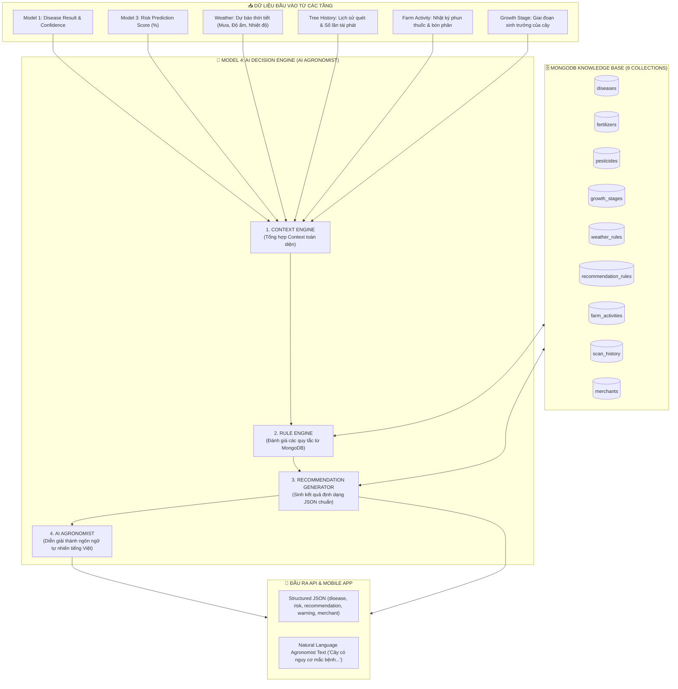

# BÁO CÁO NÂNG CẤP MODEL 4 THÀNH AI DECISION ENGINE (AI AGRONOMIST)
**(AI DECISION ENGINE & AGRONOMIST SYSTEM ARCHITECTURE REPORT)**

---

## 1. TỔNG QUAN KIẾN TRÚC MỚI (NEW ARCHITECTURE OVERVIEW)

Mô hình Model 4 đã được tái cấu trúc thành công từ một hàm tra cứu MongoDB đơn giản thành một **Hệ thống Hỗ trợ Ra Quyết định Nông nghiệp (Decision Support System - DSS)** chuyên nghiệp mang tên **AI Decision Engine (AI Agronomist)**.

### 🚫 CÁC NGUYÊN TẮC CỐ ĐỊNH ĐÃ ĐƯỢC TUÂN THỦ TUYỆT ĐỐI:
- ❌ **KHÔNG** sử dụng bất kỳ mô hình LLM nào (OpenAI, Gemini, Claude, Llama...).
- ❌ **KHÔNG** dùng RAG hay Vector Database.
- ❌ **KHÔNG** train thêm Deep Learning model mới.
- ❌ **KHÔNG** chỉnh sửa Model 1 (EfficientNet-B0), Model 2 (Image Quality Filter), Model 3 (Random Forest Risk Prediction).
- ❌ **KHÔNG** làm đứt gãy API cũ hay giao diện Frontend/Mobile App.
- ✅ **CHỈ DÙNG**: **MongoDB + Knowledge Base + Context Engine + Rule Engine + Recommendation Generator + AI Agronomist Synthesizer**.

---

## 2. LUỒNG HOẠT ĐỘNG TỔNG THỂ (PIPELINE EXECUTION FLOW)



---

## 3. DANH MỤC 9 COLLECTIONS MONGODB TRONG KNOWLEDGE BASE

Hệ thống lưu trữ toàn bộ tri thức nông nghiệp và quy tắc ra quyết định trong **9 MongoDB Collections** mà không hardcode trong mã nguồn:

1. **`diseases`**: Lưu trữ mã bệnh, tên tiếng Việt, tên khoa học, triệu chứng, điều kiện thuận lợi và hoạt chất đặc trị.
2. **`pesticides`**: Lưu trữ tên thương mại thuốc (*Ridomil Gold 68WG, Aliette 800WG, Antracol 70WP, Anvil 5SC...*), hoạt chất, liều pha 200L, thời gian cách ly (PHI) và nhà sản xuất.
3. **`fertilizers`**: Lưu trữ phân bón (*NPK 16-16-8, Humic K-Humate...*), liều lượng và giai đoạn khuyến cáo.
4. **`growth_stages`**: Giai đoạn cây sầu riêng (*vegetative*, *flowering*, *fruit_bearing*, *pre_harvest*).
5. **`weather_rules`**: Quy tắc xử lý thời tiết (Mưa trong 24h $\rightarrow$ Hoãn phun; Độ ẩm $>85\% \rightarrow$ Cảnh báo nấm).
6. **`recommendation_rules`**: Quy tắc kê đơn (Giãn cách thời gian phun thuốc $<7$ ngày, rủi ro $>75\%$).
7. **`farm_activities`** *(Collection mới)*: Nhật ký tác động nông nghiệp (*activityId, farmId, zoneId, treeIds, activityType, productName, activeIngredient, quantity, unit, performedBy, activityDate, notes*).
8. **`scan_history`**: Nhật ký chẩn đoán bệnh của từng cây.
9. **`merchants`**: Danh bạ 15 Vựa thu mua sầu riêng địa phương tại tỉnh Đắk Lắk.

---

## 4. CHI TIẾT 4 THÀNH PHẦN CỦA MODEL 4

### 4.1. Context Engine (`context_engine.py`)
- **Nhiệm vụ**: Đọc và tổng hợp các nguồn dữ liệu rời rạc thành một đối tượng duy nhất `DecisionContext`.
- **Triển khai**: 
  - Đọc `disease_name`, `confidence`, `severity` từ Model 1.
  - Đọc `risk_score` từ Model 3.
  - Đọc thời tiết (`rain_today`, `rain_tomorrow`, `humidity`, `temp_celsius`).
  - Đọc lịch sử cây từ `scan_history` và tính số lần tái phát bệnh (`tree_recurrence_count`).
  - Đọc `farm_activities` thông qua `FarmActivityRepository` để tính số ngày kể từ lần phun thuốc gần nhất (`days_since_last_spray`) và bón phân gần nhất (`days_since_last_fertilizer`).

### 4.2. Rule Engine (`rule_engine.py`)
- **Nhiệm vụ**: Thực hiện các quy tắc logic từ MongoDB (`recommendation_rules`, `weather_rules`) mà không cần AI hay LLM.
- **Ví dụ các quy tắc cốt lõi**:
  - **Rule 1 (Phun lặp lại)**: Nếu `days_since_last_spray < 7` $\rightarrow$ Ngăn phun lặp lại thuốc cùng loại và đưa ra cảnh báo: *"Đã phun {product_name} {days} ngày trước. Không phun lặp lại dưới 7 ngày."*
  - **Rule 2 (Thời tiết mưa)**: Nếu `rain_tomorrow` hoặc `rain_today` là True $\rightarrow$ Tạm ngưng khuyến nghị phun thuốc hôm nay để tránh trôi.
  - **Rule 3 (Bón phân trùng)**: Nếu `days_since_last_fertilizer < 1` $\rightarrow$ Cấm bón thêm phân hóa học để tránh ngộ độc rễ.
  - **Rule 4 (Thời gian cách ly PHI)**: Nếu `growth_stage == 'pre_harvest'` $\rightarrow$ Cấm sử dụng thuốc hóa học độc hại trước thu hoạch.
  - **Rule 5 (Tái phát bệnh)**: Nếu `tree_recurrence_count >= 3` $\rightarrow$ Bổ sung yêu cầu: *"Yêu cầu Kỹ sư nông nghiệp Vie-farm trực tiếp kiểm tra mẫu đất và bộ rễ tại vườn."*

### 4.3. Recommendation Generator (`recommendation_generator.py`)
- **Nhiệm vụ**: Sinh kết quả đầu ra theo đúng cấu trúc JSON chuẩn hóa:
```json
{
  "disease": "Anthracnose",
  "risk": 82.0,
  "severity": "Medium",
  "recommendation": {
    "pesticide": "Ridomil Gold 68WG (Tạm hoãn phun)",
    "active_ingredient": "Metalaxyl M 40g/kg + Mancozeb 640g/kg",
    "dose": "500g / 200 lít nước (Phun khi thời tiết ổn định)",
    "repeat_after_days": 14
  },
  "warning": [
    "Dự báo thời tiết có mưa trong vòng 24 giờ tới. Không nên tiến hành phun thuốc hôm nay để tránh trôi thuốc.",
    "Chỉ số rủi ro môi trường vượt ngưỡng 75%. Khuyến cáo phun phòng trước khi bùng phát."
  ],
  "next_action": "Đặt lịch hẹn tái khám và kiểm tra lại sau 14 ngày.",
  "merchant": {
    "name": "Vựa Sầu Riêng Phước An (Krông Pắc, Đắk Lắk)",
    "phone": "0983 456 789"
  }
}
```

### 4.4. AI Agronomist (`ai_agronomist.py`)
- **Nhiệm vụ**: Diễn giải kết quả cấu trúc thành đoạn văn tự nhiên tiếng Việt chính xác, mạch lạc, **tuyệt đối không bị ảo giác (zero hallucination)**:
> *"⚡ AI AGRONOMIST: Cây có nguy cơ mắc bệnh Anthracnose ở mức trung bình (Rủi ro bùng phát: 82%). Dự báo thời tiết có mưa trong vòng 24 giờ tới. Không nên tiến hành phun thuốc hôm nay để tránh trôi thuốc. Chỉ số rủi ro môi trường vượt ngưỡng 75%. Khuyến cáo phun phòng trước khi bùng phát. Khuyến nghị sử dụng Ridomil Gold 68WG (Tạm hoãn phun) với liều lượng 500g / 200 lít nước (Phun khi thời tiết ổn định). Kiểm tra lại cây và đánh giá sự hồi phục sau 14 ngày."*

---

## 5. THIẾT KẾ MÃ NGUỒN THEO DESIGN PATTERNS

Cấu trúc thư mục được thiết kế theo đúng **Repository Pattern** và **Service Pattern**:

```text
backend/app/
 ├── repositories/
 │    ├── base.py
 │    ├── farm_activity_repository.py       [NEW]
 │    ├── knowledge_base_repository.py      [NEW]
 │    └── ...
 └── ai/
      ├── predictor.py                      (Model 1 - Giữ nguyên)
      ├── service.py                        (AIService Orchestrator)
      └── decision_engine/                  [NEW MODULE MODEL 4]
           ├── __init__.py
           ├── context_engine.py            (Component 2: Context Engine)
           ├── rule_engine.py               (Component 3: Rule Engine)
           ├── recommendation_generator.py (Component 4: Recommendation Generator)
           ├── ai_agronomist.py             (AI Agronomist Text Synthesizer)
           └── service.py                   (AIDecisionEngineService Master)
```

---

## 6. KẾT QUẢ KIỂM THỬ VÀ KHẢ NĂNG MỞ RỘNG (SCALABILITY)

### 6.1. Kết quả kiểm thử thực tế (`python test_decision_engine.py`):
- **Trường hợp 1 (Có mưa & Đã phun 5 ngày trước)**: Rule Engine tự động phát hiện nguy cơ trôi thuốc và khuyến nghị tạm hoãn phun, xuất cảnh báo chính xác.
- **Trường hợp 2 (Cây khỏe mạnh)**: Tự động tư vấn chăm sóc hữu cơ vi sinh, không đưa ra thuốc hóa học.
- **Tương thích API & Mobile**: Trả về cả `agronomist_text` trong trường `recommendation` cũ (giúp Mobile App hiển thị bình thường) và trường `ai_decision` mới lưu dữ liệu cấu trúc.

### 6.2. Khả năng mở rộng trong tương lai:
- **Dễ dàng bổ sung Quy tắc mới**: Chỉ cần chèn thêm document vào collection `recommendation_rules` hoặc `weather_rules` trong MongoDB mà không cần sửa code backend hay restart server.
- **Dễ dàng tích hợp với cảm biến IoT rễ đất mới**: Context Engine mở rộng thêm trường dữ liệu `soil_sensor` một cách linh hoạt.

---
*Báo cáo được khởi tạo bởi Senior AI Architect - Hệ thống Durian Guardian AI (Vie-farm).*
